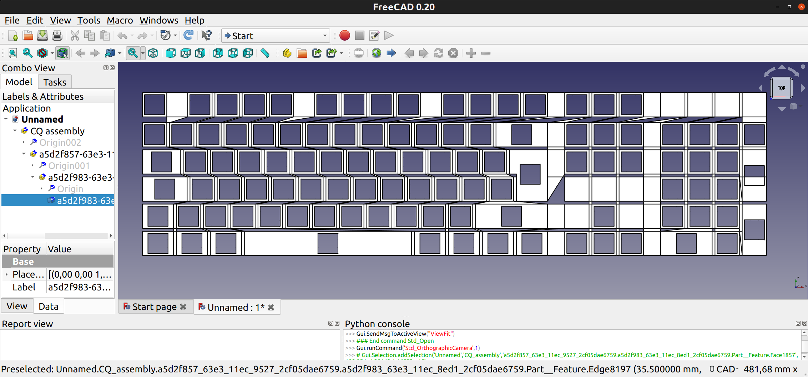

# Parametric Keyboard model Kenerator - proof of concept / under construction
This is yet another generator script that tries to generate a 3D model in STEP format for 3D printing. 

* what works yet
  * planar key placement
  * key slots with undercut (for example Gateron switches)
  * naive gap filler in between keys
  * script can be loaded with cq-editor for debugging (provides a fast result; for development)
  * script can export to STEP file format (rather slow; the exported file can be loaded with FreeCAD for refinement)

* what doesn't work now
  * planar face is not filled completely
  * no walls, no baseplate, basically nothing except of the planar keys
  * multiple configs/layouts

* what is the aim
  * highly configurable layout: ISO, ANSI, size (full, no numpad, no arrow keys)
  * split and non planar should be realize-able

* what are non-aims
  * sophisticated key cap modelling (the key is an extruded base, tapered on top)
  
## Run the script - prerequisites

* active anaconda environment with 
  * cadquery installed and 
  * python interpreter pointing to the anaconda installation and 
  * optionally cadquery editor installed (dq-editor)
  
### Run the script

    # to list all command line arguments
    python src/main.py --help
    
    # to export to STEP file (can take several minutes to export)
    python src/main.py --export

    # to render in cadquery editor  (usually takes seconds to render)
    cq-editor
    # then load src/main.py from disk, do notstart with: cq-editor src/main.py

    # to start a dry run: will compute everything but not export anythong
    python src/main.py

## Configuration
See: [./config.py](./config.py)

## Screenshots

 

