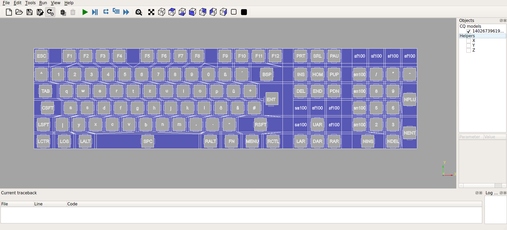

# Parametric Keyboard model Kenerator - proof of concept / under construction
This is yet another project that tries to build a parametrized 3D keyboard shell for printing.
The target is to retrieve a STEP format that can be post-processed with cad tools 
such as [FreeCAD](https://www.freecadweb.org/) instead of a mesh. 

Inspired by
* [QMK handwired/split89](https://github.com/rubienr-kbd/qmk_firmware/tree/my-master/keyboards/handwired/split89) and 
* [DIY Keybords - dactyl-keyboard](https://github.com/diykeyboards/dactyl-keyboard) which is a fork of 
* [Dactyl-ManuForm Keyboard](https://github.com/tshort/dactyl-keyboard).

what works yet
* planar key placement
* non planar key placement (simple key translation is possible)
* key slots with undercut (for Gateron switches)
* naive gap filler in between keys
* script can be loaded with cq-editor for debugging (provides a fast result; for development)
* script can be run standalone
* script can export to STEP file format (rather slow; the exported file can be loaded with FreeCAD for refinement)
* multiple configs/layouts possible

what doesn't work now
* key orientation (simple rotation to change direction the key dish shows)
* key rotation (rotation around its own Z-axis; i.e. for additional thumb keys)
* no walls
* no baseplate 
* basically nothing except of the planar slots for key switches

what is the aim
* configurable layout: ISO, ANSI, size (full, no numpad, no arrow keys)
* split keyboard and non planar layouts should be realize-able

what are non-aims
* sophisticated key cap modelling (the key is a simple extruded base, tapered on top)
  
## Run the script - prerequisites

* active anaconda environment with 
  * [cadquery](https://cadquery.readthedocs.io/en/latest/installation.html) installed (`conda install -c cadquery -c conda-forge cadquery=master`) and 
  * python interpreter pointing to the anaconda installation,
  * [cqmore](https://awesomeopensource.com/project/JustinSDK/cqMore) installed (`pip install git+git://github.com/JustinSDK/cqMore.git`) and 
  * optionally: 
    * [cadquery editor](https://github.com/CadQuery/CQ-editor) installed (`conda install -c cadquery -c conda-forge cq-editor=master`)
    * pycharm (add `~/miniconda3/bin/python` Python interpreter).
  
### Run the script

    # to list all command line arguments
    python src/main.py --help
    
    # to export to STEP file (can take several minutes to export)
    python src/main.py --export

    # to render in cadquery editor  (usually takes seconds to render)
    cd ./src
    cq-editor
    # then load main.py from disk, do notstart with cli args: cq-editor src/main.py

    # to start a dry run: will compute everything but not export anythong
    python src/main.py

## Configuration
See: [./src/config.py](./src/config.py)

## Screenshots
view in cq-editor
 

 
STEP file in FreeCad
 

 
non planar key example
 

